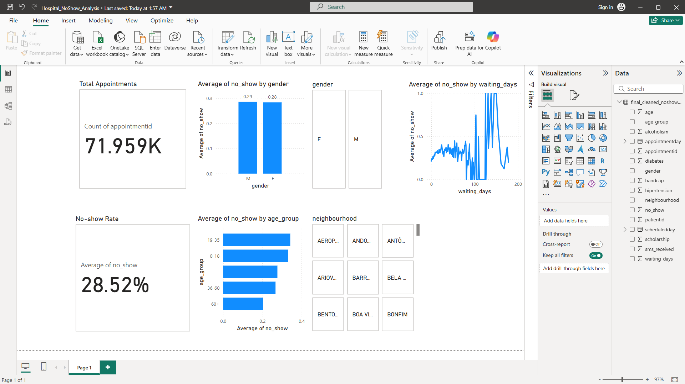

# Hospital_NoShow_Analysis

This project analyzes hospital appointment data to uncover patterns in patient no-shows. Using Python and Power BI, I built a dashboard to visualize key factors like gender, age group, SMS reminders, and wait time.

## 🚀 Tools Used

- Python (Pandas, Seaborn)
- Power BI
- Jupyter Notebook

## 📊 Key Insights

- Overall no-show rate: 28.5%
- Younger patients and those with longer waiting periods were more likely to no-show
- SMS reminders slightly reduced no-show rates
- Some neighborhoods had significantly higher no-show percentages

## 📈 Dashboard Overview

## 📁 Files Included

- `final_cleaned_noshow_data.csv`: Cleaned dataset
- `no_show_analysis.pbix`: Power BI dashboard
- `notebook.ipynb`: Python cleaning + EDA code
- `README.md`: Project summary and insights

## 🔍 Next Steps

This project could be extended to predict no-shows using logistic regression or deployed as a report for hospital admin teams to act on.
